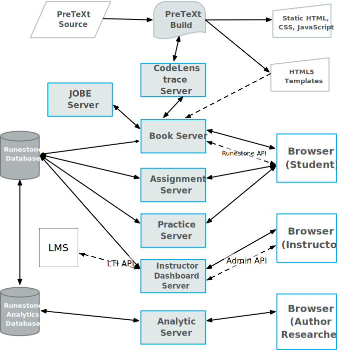

# Runestone MonoRepo

This repository collects together the various repositories related to the Runestone Academy software.  The idea of combining several repositories into a single structure was motivated and inspired by the Python polylith tools and projects.

As Runestone has grown over the years we have accreted a loads of new functionality without ever stopping to reconsider an architecture that would support easier implementation of new features while providing stability for fundamental parts of the project that need to scale.  Docker was not invented at the time Runestone development started!

The goal of this re-working of the Runestone code will provide us with a very docker friendly set of servers and services. we will use a polylith software architecture to develop and maintain this set of services.  The following diagram shows what we are aiming at.

Each of the servers in the diagram above will become a project in this repo.
* Each project is runnable from the top level
* Each project builds its own docker image
* The entire suite of services is orchestrated by the `docker-compose.yml` file

## Understanding the Code Structure

* projects - define the artifacts - Docker images or applications could be a web application or a command line application or whatever.
* bases - contains the public facing API for a project
* components - contains code that supports one or more projects/bases

* development - experimental and early work.

## A Roadmap

## Docs
This setup uses poetry and two important plugins, the multi-project plugin and the polylith plugin.

The official Polylith documentation:
[high-level documentation](https://polylith.gitbook.io/polylith)

A Python implementation of the Polylith tool:
[python-polylith](https://github.com/DavidVujic/python-polylith)

