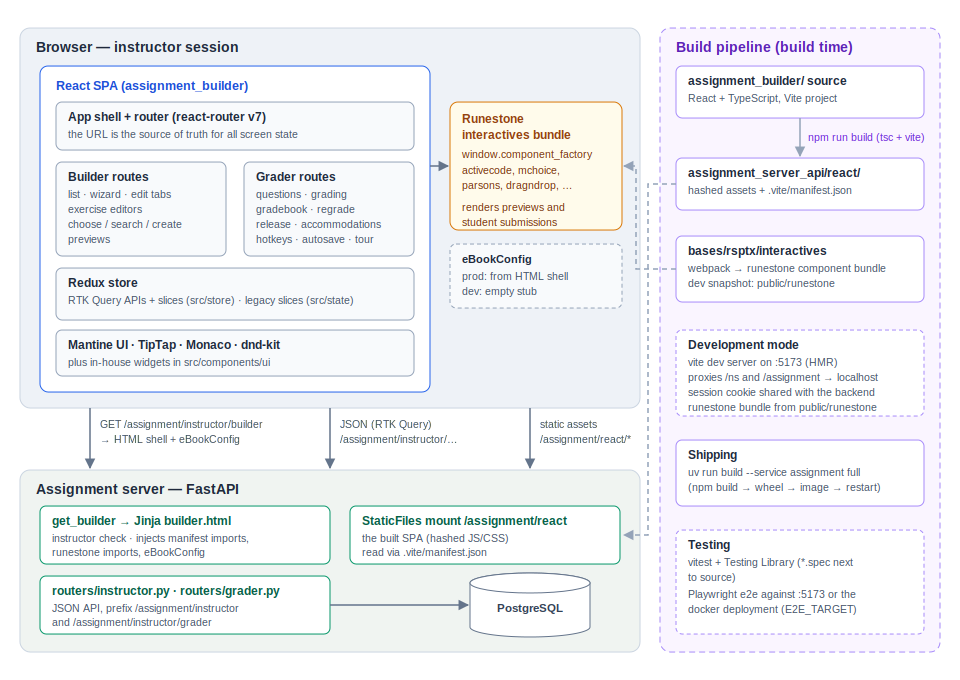

The Assignment Builder and Grader (React)
==========================================

The assignment builder and the grader are a single React single-page
application that instructors use to create assignments, choose or author
exercises, grade student work, and manage grades.  It lives in
``bases/rsptx/assignment_server_api/assignment_builder`` and is served by the
FastAPI **assignment server** (``bases/rsptx/assignment_server_api``).  In a
running Runestone instance the app is reached at:

* ``/assignment/instructor/builder`` -- the assignment builder
* ``/assignment/instructor/grader`` -- the grader

Both URLs load the same bundle; client-side routing selects the view.  The
app replaces the old web2py instructor pages, and a couple of the very first
React screens it replaced are themselves still around as legacy routes
(``/builderV2`` and ``/graderOld``) -- see `Two generations of code`_ below.

         browser and talk to the FastAPI assignment server, which serves the
         HTML shell, the JSON API, and the built static assets; a separate
         build pipeline produces those assets.

   Overview of the assignment builder and grader.  The left side is the
   runtime picture (browser above, assignment server below); the right
   column shows how the pieces are built, tested, and shipped.

Technology stack
----------------

* **React 18** with **TypeScript** (``strict`` mode; some older files are
  still plain ``.jsx``).
* **Vite** for the dev server and production build.
* **Redux Toolkit** for state, with **RTK Query** for all server
  communication.
* **react-router v7** with URL-driven state (the URL is the source of truth
  for which assignment, tab, wizard step, or student is showing).
* **Mantine** as the UI component library (plus a small set of in-house
  components in ``src/components/ui``: DataGrid, TreeTable, EditableTable,
  notify, ...).
* **TipTap** for rich-text question authoring, **Monaco** for code editing,
  **dnd-kit** for drag and drop, **TanStack Table** for grids,
  **driver.js** for the built-in feature tours.
* **vitest** + Testing Library for unit tests, **Playwright** for end-to-end
  tests, **eslint**/**prettier** for style.

How the app is served
---------------------

Development
~~~~~~~~~~~

In development the app runs on Vite's dev server (port 5173).
``vite.config.ts`` proxies API paths (``/ns`` and ``/assignment``) to
``http://localhost``, where the normal Docker composition (or ``dstart``
servers) must be running.  Authentication rides along on the Runestone
session cookie: log in as an instructor at ``http://localhost`` first, then
open ``http://localhost:5173`` -- the cookie is shared because both are on
``localhost``.

Two things that a served book page normally provides are stubbed in
development by ``index.html``:

* ``eBookConfig`` is created as an *empty* object.  Anything that reads
  ``window.eBookConfig`` (for example the course name in the navbar) sees
  defaults in dev mode.
* The Runestone interactives bundle (the webpack build of
  ``bases/rsptx/interactives``) is loaded dynamically by reading
  ``webpack_static_imports.json`` from ``VITE_LOAD_PREFIX``
  (``/runestone`` in dev, see ``.env.development``).  Vite serves that
  prefix from the checked-in snapshot in ``public/runestone``.  If you need
  newer component JavaScript in dev, rebuild the interactives and refresh
  that snapshot.

The interactives bundle is what lets the builder and grader render real
Runestone questions (previews, student answers): it registers
``window.component_factory`` entries which the React code invokes through
``src/componentFuncs.js``.

Production
~~~~~~~~~~

``npm run build`` type-checks (``tsc -p tsconfig.build.json``) and then has
Vite emit the production bundle **into the sibling directory**
``bases/rsptx/assignment_server_api/react`` together with a
``.vite/manifest.json``.  The assignment server:

* mounts that directory as static files at ``/assignment/react``
  (``core.py``),
* serves the page itself from the ``get_builder`` endpoint in
  ``routers/instructor.py``.  That endpoint verifies the user is an
  instructor for the course, then renders the Jinja template
  ``components/rsptx/templates/assignment/instructor/builder.html``, which

  - injects the hashed JS/CSS names read from the Vite manifest
    (``get_react_imports`` in ``rsptx.response_helpers``),
  - injects the per-course Runestone interactives imports
    (``get_webpack_static_imports``),
  - emits a real ``eBookConfig`` (course, user, ``author`` name, LaTeX
    preamble, ...),
  - provides the ``
`` mount point.

So in production the React app is a set of static assets plus a
server-rendered shell page; there is no server-side React.

The build is wired into the normal service build:
``projects/assignment_server/build.py`` runs ``npm install`` and
``npm run build`` in ``assignment_builder`` (it requires the interactives to
have been built first), and ``uv run build --service assignment full``
rebuilds wheel, image, and container.  The wheel deliberately excludes
``react/runestone``, ``public/runestone``, ``node_modules`` and other heavy
frontend artifacts (see ``projects/assignment_server/pyproject.toml``).

Application architecture
------------------------

Entry point and shell
~~~~~~~~~~~~~~~~~~~~~

``src/index.tsx`` creates the Redux store provider and the Mantine
providers (theme, modals, notifications) and renders ``App``.
``src/App.tsx`` builds the router.  Every route renders inside
``AppContent``, which provides the application shell: the top navigation
bar (``src/components/shell/AppNavBar``, fed by ``navUtils.ts`` and
``eBookConfig``) and the scrollable content region.  Routes matching
``/builder`` or ``/grader`` render "full bleed"; everything else is wrapped
in a centered container.

Routing: the URL is the state
~~~~~~~~~~~~~~~~~~~~~~~~~~~~~

The route table in ``App.tsx`` is the map of the application::

    /                                    -> AssignmentBuilder (lazy)
    /builder                             -> AssignmentBuilder (lazy)
    /builder/create[/:step]              -> creation wizard
    /builder/:assignmentId[/:tab]        -> edit an assignment (basic|readings|exercises)
    /builder/:id/exercises/:viewMode/... -> exercise list / browse / search / create / edit
    /grader                              -> Grader (lazy), assignment list
    /grader/gradebook                    -> gradebook
    /grader/:assignmentId                -> question list for an assignment
    /grader/:assignmentId/questions/:questionId[/students/:sid]
                                         -> grade one question / one student
    /builderV2, /graderOld               -> legacy first-generation screens
    /except                              -> deadline-exception scheduler

The two big route components are loaded lazily so the builder does not pay
for the grader's code and vice versa.  Inside the builder, the hook
``useAssignmentRouting`` parses the URL into a typed route state (mode,
wizard step, active tab, exercise view mode, exercise type/step, ...) and
provides navigation helpers; components never keep "which screen am I on"
in local state.  Deep links and browser back/forward therefore just work,
and the e2e tests rely on that.

State management
~~~~~~~~~~~~~~~~

All server communication goes through **RTK Query** APIs, one per feature
folder in ``src/store``::

    src/store/
      assignment/           assignment CRUD        (assignment.logic.api.ts + assignment.logic.ts)
      assignmentExercise/   exercises attached to an assignment
      readings/             readings attached to an assignment
      exercises/            question CRUD / search
      chooseExercises/      the book-tree exercise chooser (slice only)
      searchExercises/      smart search state (slice only)
      dataset/, datafile/   supporting data
      grader/               everything the grader needs
      user/                 current user info

The convention within a feature folder is ``<feature>.logic.api.ts`` for the
RTK Query API (endpoints, cache tags) and ``<feature>.logic.ts`` for a
companion slice holding client-side state.  All endpoints hit the FastAPI
assignment server under ``/assignment/instructor/...``; the grader API uses
``/assignment/instructor/grader/...``.  ``src/store/baseQuery.ts`` supplies
the shared ``fetchBaseQuery`` plus an error-handling wrapper that pops a
Mantine notification on failures (with a specific message for expired
sessions).

Two generations of code
~~~~~~~~~~~~~~~~~~~~~~~

There are **two** state trees and two component styles in the repository,
and it is important to know which is which:

* ``src/store`` + ``src/components/routes`` -- the current generation:
  TypeScript, RTK Query, Mantine.  This is where new work goes.
* ``src/state`` + ``src/renderers`` -- the first generation: plain ``.jsx``
  renderers and hand-written slices (``acSlice``, ``assignSlice``,
  ``ePickerSlice``, ...).  These power the legacy ``/builderV2`` and
  ``/graderOld`` routes and a few shared selectors (for example
  ``selectIsAuthorized``, which gates the whole app).

The store that actually runs is ``src/state/store.ts``; it combines *both*
generations' reducers.  Watch out for one naming trap: the key
``assignment`` in the live store belongs to the **legacy** ``assignSlice``,
while the new ``assignmentSlice`` is registered as ``assignmentTemp``.
(``src/store/store.ts`` builds a store from only the new reducers and is
used by tests.)  When the legacy routes die, the intent is for
``src/store/rootReducer.ts`` to become the real root.

The assignment builder
~~~~~~~~~~~~~~~~~~~~~~

``src/components/routes/AssignmentBuilder`` contains:

* ``components/list`` -- the assignment list (entry screen).
* ``components/wizard`` -- the three-step creation wizard
  (basic info, assignment type, visibility).
* ``components/edit`` -- the edit view with its ``basic``/``readings``/
  ``exercises`` tabs.
* ``components/reading`` -- picking book sections to read.
* ``components/exercises`` -- the largest subsystem.  The exercises tab can
  list what is assigned (``AssignmentExercisesList``), browse the book tree
  (``ChooseExercises``), search the question bank (``SearchExercises``), or
  author a brand new question (``CreateExercise``).
* ``hooks`` -- ``useAssignmentRouting`` (above), ``useAssignmentForm``,
  ``useAssignmentState``, name validation.

``CreateExercise`` is a small framework of its own.  ``ExerciseFactory.tsx``
switches on the question type and renders one editor component per type
(``MultiChoiceExercise``, ``ActiveCodeExercise``, ``ParsonsExercise``,
``FillInTheBlankExercise``, ``DragAndDropExercise``, ``ClickableAreaExercise``,
``PollExercise``, ``ShortAnswerExercise``, ``MatchingExercise``,
``SelectQuestionExercise``, ``IframeExercise``).  Each editor is a stepped
form built on ``BaseExerciseForm`` and shared TipTap-based inputs; shared
step/validation plumbing lives in ``CreateExercise/shared`` and
``CreateExercise/hooks``.  Display metadata for the type chooser (family,
label, tag, icon, color) comes from ``src/config/exerciseTypes.ts``.
Question JSON import (see :doc:`question_json_schema`) is handled by
``ImportQuestionJsonModal`` with helpers in ``src/utils/importQuestionJson.ts``.

Previews render the actual Runestone component: helpers in
``src/utils/preview`` generate the component HTML for each question type
and ``renderRunestoneComponent`` in ``src/componentFuncs.js`` asks the
globally loaded interactives bundle (``window.component_factory``) to bring
it to life inside a ref'd div.

The grader
~~~~~~~~~~

``src/components/routes/Grader`` is organized as pages plus supporting
components and hooks:

* ``pages/GraderAssignmentsPage`` -- pick an assignment.
* ``pages/GraderQuestionsPage`` -- per-question stats for the assignment.
* ``pages/GraderQuestionPage`` -- the working view: a student list sidebar,
  the student's submission rendered as a live Runestone component
  (``SubmissionPane``), and the grading panel (``GradePanel``).
* ``pages/GraderGradebookPage`` -- the gradebook grid.

Notable behaviors, each with its own hook or component: grade autosave
(``useAutoSaveGrade`` + ``SaveStatusPill``), keyboard-driven grading
(``useGraderHotkeys``, ``ShortcutsHelpDialog``), multi-student grading
(``MultiGradeDialog``, ``StudentMultiSelect``), regrading with a preview
step (``RegradeWizard``), releasing grades and pass thresholds
(``ReleaseGradesControl``, ``ThresholdControl``), manual totals, deadline
accommodations (``DeadlineExceptionDialog``), and a driver.js onboarding
tour (``useGraderTour``, ``tour/``).  The server side for all of this is
``routers/grader.py`` (endpoints for answers, history, grades, regrade
preview/apply, release, thresholds, gradebook data, rosters,
accommodations).

Getting started for programmers
-------------------------------

Prerequisites
~~~~~~~~~~~~~

Node 18+ and npm 8+ (enforced in ``package.json``), plus a working local
Runestone (see :doc:`docker`).  All commands below run from
``bases/rsptx/assignment_server_api/assignment_builder``.

The edit/run loop
~~~~~~~~~~~~~~~~~

1. Start the backend: ``docker compose --profile basic up`` from the repo
   root (or the ``dstart`` development servers -- then adjust the proxy
   ports in ``vite.config.ts``).
2. Log in at ``http://localhost`` as an instructor (``testuser1`` in the
   standard dev database).
3. ``npm install`` (first time), then ``npm start``.
4. Open ``http://localhost:5173`` for the builder,
   ``http://localhost:5173/grader`` for the grader.  Vite hot-reloads your
   edits; API calls are proxied to the backend from step 1.

Where things go
~~~~~~~~~~~~~~~

============================================  ====================================================
Path                                          What lives there
============================================  ====================================================
``src/App.tsx``                               route table
``src/components/routes/AssignmentBuilder``   builder screens, wizard, exercise editors
``src/components/routes/Grader``              grader pages, grading widgets, hotkeys, tour
``src/components/shell``                      navbar and app shell
``src/components/ui``                         reusable widgets (DataGrid, TreeTable, notify, ...)
``src/store/<feature>``                       RTK Query API + slice for one feature
``src/hooks``                                 cross-feature hooks
``src/config/exerciseTypes.ts``               exercise-type metadata (labels, families, icons)
``src/utils`` / ``src/utils/preview``         pure helpers; per-type preview HTML generators
``src/types``                                 shared TypeScript types
``src/state``, ``src/renderers``              legacy generation -- avoid for new work
``e2e/``                                      Playwright suites
============================================  ====================================================

Path aliases ``@/*``, ``@store/*`` and ``@components/*`` are configured in
both ``tsconfig.json`` and ``vite.config.ts``.

Conventions
~~~~~~~~~~~

* New code is TypeScript with ``strict`` on; prefer function components and
  hooks.
* Tests are colocated: ``Foo.tsx`` has ``Foo.spec.tsx`` next to it.
* Lint must be clean -- CI style is ``npm run test:eslint``
  (``--max-warnings=0``).  Prettier settings are in ``.prettierrc``.
* Server data belongs in an RTK Query endpoint, not in a hand-rolled
  ``fetch``; client-only state belongs in the feature's slice; screen
  identity belongs in the URL.

Testing
~~~~~~~

* ``npm test`` -- vitest in watch mode with coverage (jsdom, Testing
  Library; global setup in ``vitest.setup.ts``).
* ``npm run test:e2e`` -- Playwright against the Vite dev server (it logs
  in via the backend, so steps 1-2 of the edit/run loop must be running).
  ``npm run test:e2e:smoke`` runs the ``@p0`` subset;
  ``test:e2e:docker`` targets the app as served by Docker/nginx instead of
  Vite (``E2E_TARGET=docker``).
* One-off suites live under ``e2e/<area>`` (assignments, exercises,
  grader, wizard, tiptap, ...) with fixtures in ``e2e/fixtures``.

Common tasks
~~~~~~~~~~~~

**Adding a server-backed feature.**  Add the endpoint to the FastAPI side
(``routers/instructor.py`` or ``routers/grader.py``), then add an endpoint
to the feature's ``*.logic.api.ts`` with appropriate cache tags so lists
refetch when mutations invalidate them.  Components consume the generated
hooks (``useGetXQuery``, ``useUpdateXMutation``).

**Adding a screen or sub-view.**  Add the path to the route table in
``App.tsx``; for builder sub-views also extend ``useAssignmentRouting`` so
the new URL shape round-trips to route state.  Keep the component lazy if
it is heavy.

**Adding a new exercise type editor.**  The checklist:

1. Register the type in ``src/config/exerciseTypes.ts`` (family, label,
   tag, description, icon).
2. Create ``CreateExercise/components/<YourType>Exercise`` following an
   existing editor (start from a simple one like ``PollExercise``); build
   the steps on ``BaseExerciseForm`` and the shared inputs.
3. Add the case to ``ExerciseFactory.tsx`` and the export to the folder's
   ``index.ts``.
4. Add a preview generator in ``src/utils/preview`` that emits the
   component's HTML so ``ExercisePreview`` can render it (the interactives
   bundle must know the type -- see :doc:`javascript_feature`).
5. If the type supports question-JSON authoring, extend
   ``src/utils/importQuestionJson.ts`` and see :doc:`question_json_schema`.
6. Server side: make sure ``new_question``/``update_question`` in
   ``routers/instructor.py`` accept the type and that htmlsrc generation is
   correct.

**Shipping.**  ``npm run build`` writes the production bundle to
``../react``; build and restart the service with
``uv run build --service assignment full`` (or run
``projects/assignment_server/build.py``, which performs the npm build for
you).  Remember the interactives must be built first if their dist is
missing.

Gotchas
~~~~~~~

* **Two store generations.**  The running store is ``src/state/store.ts``;
  the ``assignment`` key is the *legacy* slice, the new one is
  ``assignmentTemp``.  Put new state in ``src/store``.
* **eBookConfig is empty in dev.**  Production pages inject a real one via
  the ``builder.html`` template; guard reads accordingly.
* **The interactives bundle is global.**  Question previews and submission
  rendering depend on ``window.component_factory`` from the separately
  built ``bases/rsptx/interactives`` webpack bundle (snapshot in
  ``public/runestone`` for dev).  ``public/jQuery.js`` is still loaded for
  the remaining jQuery-dependent interactive (codelens/pytutor).
* **URL first.**  Resist adding "current screen" component state; extend
  the routing instead, or deep links and the e2e suites will break.
* **Instructor-only.**  ``get_builder`` redirects non-instructors, and the
  app renders a sign-in message when the first assignment fetch is
  unauthorized (``selectIsAuthorized``).

See also ``README.md`` and ``DEV_NOTES.rst`` in the ``assignment_builder``
directory for historical notes.
